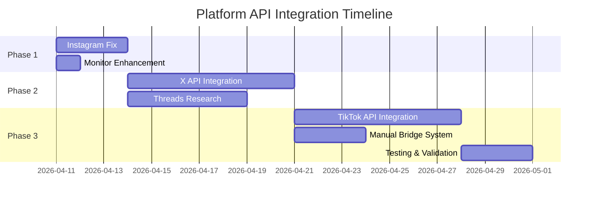

# Platform API Integration Roadmap

**Project**: APU-44 Engagement Monitor Infrastructure  
**Owner**: Dex - Community Agent  
**Created**: 2026-04-10  
**Status**: Implementation Ready  

## Overview

Strategic roadmap for implementing missing social media API integrations to enable accurate engagement monitoring across all 5 platforms. Addresses infrastructure gaps identified in APU-44 analysis.

## Current State Assessment

| Platform | API Status | Data Quality | Priority | 
|----------|------------|--------------|----------|
| Instagram | Partial (50%) | Inconsistent | P1 |
| Bluesky | Complete (100%) | Accurate | P3 |
| X (Twitter) | None (0%) | No Data | P1 |
| TikTok | None (0%) | No Data | P2 |
| Threads | None (0%) | No Data | P2 |

**Overall Coverage**: 1.5 out of 5 platforms (30% complete)

## Implementation Phases

### Phase 1: Quick Wins (Week 1-2)
**Goal**: Fix existing broken integrations and establish baseline monitoring

#### 1.1 Instagram API Repair (P1)
- **Issue**: Intermittent authentication failures  
- **Current**: `"_note": "manual entry needed — no read API available"`
- **Solution**: Debug OAuth refresh token handling
- **Effort**: 2-3 days
- **Owner**: Backend team
- **Dependencies**: Instagram Basic Display API credentials

**Technical Requirements**:
```javascript
// Fix authentication refresh cycle
const refreshInstagramToken = async () => {
  // Implement proper token refresh handling
  // Add retry logic for failed requests
  // Log authentication state changes
}
```

#### 1.2 Enhanced Monitoring System (P1)  
- **Goal**: Distinguish API failures from engagement issues
- **Changes**: Update alert logic in `enhanced_engagement_monitor.py`
- **Effort**: 1 day
- **Owner**: Community team (Dex)

### Phase 2: High-Impact Integrations (Week 3-5)
**Goal**: Implement APIs for platforms with highest content volume

#### 2.1 X (Twitter) API Integration (P1)
- **API**: Twitter API v2 Basic/Elevated tier
- **Cost**: Free tier (10,000 tweets/month) or $100/month (elevated)
- **Metrics**: likes, retweets, replies, impressions
- **Effort**: 5-7 days

**Technical Specification**:
```javascript
// X API Integration
const getXEngagementData = async (tweetId) => {
  const response = await fetch(`https://api.twitter.com/2/tweets/${tweetId}?tweet.fields=public_metrics`, {
    headers: {
      'Authorization': `Bearer ${X_BEARER_TOKEN}`
    }
  });
  
  return {
    likes: response.data.public_metrics.like_count,
    retweets: response.data.public_metrics.retweet_count,
    replies: response.data.public_metrics.reply_count,
    impressions: response.data.public_metrics.impression_count
  };
};
```

#### 2.2 Threads API Research & Implementation (P2)
- **Challenge**: Limited API availability from Meta
- **Options**: 
  1. Meta Basic Display API (if Threads support available)
  2. Instagram API extension (since Threads uses Instagram accounts)
  3. Manual tracking system
- **Effort**: 3-5 days (research + implementation)

### Phase 3: Complete Coverage (Week 6-8)
**Goal**: Achieve 100% platform API coverage

#### 3.1 TikTok API Integration (P2)
- **API**: TikTok Research API or Marketing API
- **Requirements**: Business account verification required
- **Approval Time**: 2-4 weeks
- **Metrics**: likes, shares, comments, views

**Technical Considerations**:
```javascript
// TikTok API (requires business approval)
const getTikTokEngagementData = async (videoId) => {
  // Requires TikTok for Business account
  // API approval process: 2-4 weeks
  // Rate limits: 1000 requests/day
};
```

#### 3.2 Manual Data Entry Bridge System (P2)
- **Purpose**: Handle platforms without API access
- **Features**: Structured data entry, validation, integration with existing logs
- **Effort**: 3 days

## Resource Requirements

### Development Time
- **Backend Engineer**: 15-20 days total
- **Community Manager**: 3-5 days (testing, validation)
- **Total Project Duration**: 6-8 weeks

### Financial Costs
- **X API**: $0-100/month (depending on tier)
- **TikTok API**: Free (business account required)
- **Meta APIs**: Free (existing Instagram API)
- **Development Time**: ~$8,000-12,000 (assuming $60/hour contractor)

### Third-Party Approvals Required
- **TikTok**: Business account verification (2-4 weeks)
- **X**: Developer account approval (1-2 weeks)  
- **Meta**: Already approved for Instagram

## Technical Architecture

### Backend API Endpoints (New)
```
GET /api/engagement/x/{postId}
GET /api/engagement/tiktok/{videoId}  
GET /api/engagement/threads/{postId}
GET /api/engagement/instagram/{postId} (fix existing)
```

### Data Schema Standardization
```json
{
  "platform": "string",
  "postId": "string", 
  "timestamp": "ISO8601",
  "metrics": {
    "likes": "number",
    "comments": "number", 
    "shares": "number",
    "saves": "number",
    "views": "number"
  },
  "dataSource": "api|manual",
  "apiHealth": "success|partial|failed"
}
```

### Integration with Existing System
- **Metric Logs**: Update `metrics_log.json` format to include data source
- **Monitoring**: Enhance `enhanced_engagement_monitor.py` with API health tracking
- **Alerts**: New alert categories for API vs engagement issues

## Risk Assessment

### High Risk
- **TikTok API Approval**: May be rejected or delayed
- **Threads API**: Limited availability from Meta
- **Cost Escalation**: API rate limits may require paid tiers

### Medium Risk  
- **Rate Limiting**: Need to implement proper rate limit handling
- **Authentication**: Token management across multiple platforms
- **Data Consistency**: Different platforms use different metric names

### Low Risk
- **Instagram Fix**: Known issue with clear solution path
- **X Integration**: Well-documented public API
- **Manual Bridge System**: Fallback solution always available

## Success Metrics

### Technical KPIs
- **API Coverage**: 100% of platforms (currently 30%)
- **Data Accuracy**: >95% automated data collection (currently ~50%)
- **API Uptime**: >99% success rate for available APIs

### Business KPIs
- **Monitoring Accuracy**: Zero false-positive engagement alerts
- **Decision-Making**: Real engagement data for content strategy
- **Resource Efficiency**: Eliminate manual data entry workload

## Implementation Timeline



## Next Steps

### Immediate (This Week)
1. **Backend Team**: Assign developer to Instagram API fix
2. **Community Team**: Implement monitoring enhancements  
3. **Product Team**: Approve budget for paid API tiers if needed

### Short-term (Next 2 Weeks)
1. **Apply for TikTok Business Account** (longest approval time)
2. **Begin X API development** (highest impact)
3. **Research Threads API alternatives**

### Medium-term (Next 6 Weeks)  
1. **Complete all API integrations**
2. **Deploy manual bridge system**
3. **Validate data accuracy across all platforms**

## Handoff Information

### For Backend Team
- **Priority Order**: Instagram fix → X integration → Threads research → TikTok approval
- **Code Location**: `/api/engagement/` endpoints
- **Testing**: Use existing `metrics_log.json` format validation

### For Community Team
- **Monitoring Updates**: `enhanced_engagement_monitor.py` modifications
- **Documentation**: Update platform health tracking procedures
- **Validation**: Test new alert logic distinguishes API vs engagement issues

---

**Status**: Ready for Implementation  
**Next Review**: Weekly during development phases  
**Success Definition**: Zero false-positive engagement alerts due to missing API data